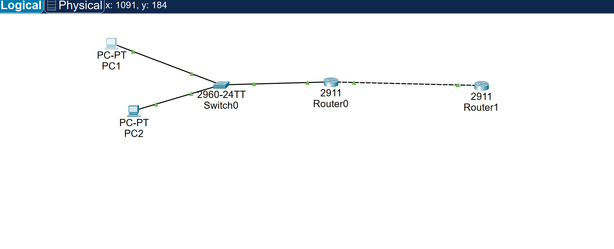

# DHCP Relay Troubleshooting Lab

> **Status: In progress.** The original and later saved Packet Tracer projects, twenty-seven distinct screenshots, and [SW1](configs/SW1-running-config.txt), sanitized [R1 relay](configs/R1-running-config.txt), and sanitized [R2 DHCP server](configs/R2-running-config.txt) running configs are present. Both clients show DHCP leases and identified gateway pings. A router CLI successfully pings both client addresses, though its device identity is not visible. The fault case shows helper removal from R1 G0/0.10, PC1 DHCP failure alongside PC2's working lease, helper restoration, and an identified PC1 recovered lease. The later `.pkt` is uploaded but has not been opened here to verify its saved state. The new PC2-to-server ping is attributable; the supplied PC1-to-server ping is cropped without its PC title, so an identified PC1 capture remains pending. Do not call this lab complete until the repository's [evidence checklist](../PORTFOLIO_CHECKLIST.md) is satisfied.

## Support Ticket and Objective

PC1 on VLAN 10 cannot obtain an IPv4 lease from a DHCP server on a different routed network. Build a two-client, two-VLAN network with R1 as the gateway and DHCP relay, and R2 as the central DHCP server. Establish a working baseline, remove the helper from one client gateway to reproduce the ticket, locate the fault, restore the helper, then prove both clients receive the correct lease and can reach the server. Record actual observations only after building the lab.

## Planned Topology

```text
PC1 (VLAN 10) -- SW1 -- 802.1Q trunk -- R1 -- 10.0.12.0/30 -- R2 (DHCP server)
PC2 (VLAN 20) -- SW1 -- same trunk -- R1
```



The [original Packet Tracer project](packet-tracer/dhcp-relay.pkt) and [later uploaded project](dhcp-relay-final.pkt) are available. The original project contains a visible two-PC, 2960 Switch0, 2911 Router0, and 2911 Router1 layout. Screenshots identify Router0 as R1 and show R1 G0/0.10 `192.168.10.1`, G0/0.20 `192.168.20.1`, and G0/1 `10.0.12.1`, all up/up. The [R2 configuration](configs/R2-running-config.txt) shows `10.0.12.2/30` on G0/0 and the [SW1 configuration](configs/SW1-running-config.txt) shows Fa0/1 in VLAN 10, Fa0/2 in VLAN 20, and G0/1 as trunk. The switch and PC names in the topology and screenshots support the client mapping; the saved Packet Tracer project has not been opened here to independently check cabling.

| Device | Interface / VLAN | Address or expected lease | Gateway / purpose |
|---|---|---|---|
| PC1 | NIC / VLAN 10 | DHCP `192.168.10.21/24` observed | `192.168.10.1` observed |
| PC2 | NIC / VLAN 20 | DHCP `192.168.20.21/24` observed | `192.168.20.1` observed |
| SW1 | PC1 access port | VLAN 10 | Client attachment |
| SW1 | PC2 access port | VLAN 20 | Client attachment |
| SW1 | R1 uplink | Trunk allowing 10, 20 | Router on a stick |
| R1 | G0/0.10 | `192.168.10.1/24` | VLAN 10 gateway and helper |
| R1 | G0/0.20 | `192.168.20.1/24` | VLAN 20 gateway and helper |
| R1 | G0/1 | `10.0.12.1/30` | Routed link to R2 |
| R2 | G0/0 | `10.0.12.2/30` | DHCP service address |

The R1 and PC entries come from screenshots. R2's [routing table](images/r2-return-routes-installed.png) shows connected `10.0.12.0/30` on G0/0, local `10.0.12.2/32`, and installed static routes to both VLANs via `10.0.12.1`. The newer [DHCP configuration screenshot](images/r2-dhcp-config-current.png) shows `USERSPOOL` (`192.168.10.0/24`) with gateway `192.168.10.1`, `ADMINPOOL` (`192.168.20.0/24`) with gateway `192.168.20.1`, DNS `1.1.1.1`, and exclusions through `.20` in each subnet. The earlier screenshot omitted the ADMINPOOL gateway; the newer one resolves the **configuration state** discrepancy, but the change sequence and any claimed repair are not documented. A correct lease and one server ping do not demonstrate the deliberate relay fault case.

## Key Configuration to Build

Example IOS commands for the target design, not an export from the uploaded project. Reconcile interface assignments with the actual configuration. Save full sanitized running configurations separately after testing.

```cisco
! SW1: assign PC access ports to VLAN 10 and VLAN 20;
! make the R1 uplink a trunk allowing 10,20.
! R1
interface GigabitEthernet0/0
 no shutdown
interface GigabitEthernet0/0.10
 encapsulation dot1Q 10
 ip address 192.168.10.1 255.255.255.0
 ip helper-address 10.0.12.2
interface GigabitEthernet0/0.20
 encapsulation dot1Q 20
 ip address 192.168.20.1 255.255.255.0
 ip helper-address 10.0.12.2
interface GigabitEthernet0/1
 ip address 10.0.12.1 255.255.255.252
 no shutdown
```

```cisco
! R2
interface GigabitEthernet0/0
 ip address 10.0.12.2 255.255.255.252
 no shutdown
ip route 192.168.10.0 255.255.255.0 10.0.12.1
ip route 192.168.20.0 255.255.255.0 10.0.12.1
! Exclusions in the project must be reviewed and preserved or revised intentionally.
ip dhcp pool USERSPOOL
 network 192.168.10.0 255.255.255.0
 default-router 192.168.10.1
ip dhcp pool ADMINPOOL
 network 192.168.20.0 255.255.255.0
 default-router 192.168.20.1
```

## Verification and Evidence Plan

### Evidence received so far

| Screenshot | Directly supported observation |
|---|---|
| [SW1 VLANs](images/sw1-vlans.png) | VLAN 10 `USERS` on Fa0/1; VLAN 20 `ADMIN` on Fa0/2 |
| [SW1 trunk](images/sw1-trunk.png) | G0/1 is trunking, with VLANs 10 and 20 allowed, active, and forwarding |
| [R1 interfaces](images/r1-interfaces.png) | G0/0.10 `.10.1`, G0/0.20 `.20.1`, and G0/1 `10.0.12.1` are up/up |
| [R1 helper configuration](images/r1-helper-config.png) | `ip helper-address 10.0.12.2` appears on both G0/0.10 and G0/0.20; also present on unnumbered parent G0/0 |
| [R2 DHCP configuration](images/r2-dhcp-config.png) | USERSPOOL includes its gateway; ADMINPOOL lacks a `default-router` line |
| [Newer R2 DHCP configuration](images/r2-dhcp-config-current.png) | Both pools include their respective `default-router`; excludes `.0–.20` for VLAN 10 and `.1–.20` for VLAN 20 |
| [R2 return-route configuration](images/r2-return-route-config.png) | Static routes for `192.168.10.0/24` and `192.168.20.0/24` via `10.0.12.1` |
| [R2 installed routing table](images/r2-return-routes-installed.png) | Both routes appear with `S` code via `10.0.12.1`; R2 local address is `10.0.12.2` |
| [R2 pool counters](images/r2-dhcp-pools.png) | ADMINPOOL shows 1 leased address; USERSPOOL shows 0 at capture time. Counters do not identify a client or prove a usable lease. |
| [PC1 DHCP lease](images/pc1-lease.png) | FastEthernet0 `192.168.10.21/24`, gateway `192.168.10.1`, DHCP server `10.0.12.2` |
| [PC2 DHCP lease](images/pc2-lease.png) | FastEthernet0 `192.168.20.21/24`, gateway `192.168.20.1`, DHCP server `10.0.12.2` |
| [R2 DHCP bindings](images/r2-dhcp-bindings.png) | `192.168.10.21` maps to PC1 MAC `00E0.8F10.5797`; `192.168.20.21` maps to PC2 MAC `0001.43D1.67BD`; both automatic |
| [Supplied PC ping to server](images/pc2-to-server-ping.png) | `ping 10.0.12.2` returns 4/4 replies, 0% loss. Uploaded as PC2 evidence, but the crop does not show the PC identity. The second uploaded copy is byte-for-byte identical. This is a server ping, despite one upload filename calling it a gateway ping. |
| [VLAN 10 gateway ping](images/vlan10-gateway-ping.png) | `ping 192.168.10.1` returns 4/4 replies, 0% loss. Uploaded as PC1 evidence, but the crop does not show the PC identity. |
| [Identified PC2 gateway ping](images/pc2-gateway-ping-identified.png) | PC2 title visible; `ping 192.168.20.1` returns 4/4 replies, 0% loss. Timing relative to the helper fault is not established. |
| [Identified PC1 gateway ping](images/pc1-gateway-ping-identified.png) | PC1 title visible; `ping 192.168.10.1` returns 4/4 replies, 0% loss. Timing relative to the helper fault is not established. |
| [Uploaded PC1-to-server ping, title cropped](images/pc1-to-server-ping-unattributed.png) | `ping 10.0.12.2` returns 4/4 replies, 0% loss. Filename says PC1 but screenshot does not display a client title; attribution and timing relative to repair are unconfirmed. |
| [Identified PC2-to-server ping](images/pc2-to-server-ping.png) | PC2 title visible; `ping 10.0.12.2` returns 4/4 replies, 0% loss. Timing relative to repair is not visible. |
| [Router to both clients](images/router-to-both-clients-ping.png) | `Router#` pings `192.168.10.21` and `192.168.20.21`, both 5/5. The router's device name is not visible, and these are router-to-PC tests rather than PC-to-server tests. |

The R1 helper screenshot shows the Packet Tracer device name `Router0`; other CLI screenshots have generic `Router#` and `Switch#` prompts. The [R1 running config](configs/R1-running-config.txt) confirms the relay interface assignments; the [SW1 running config](configs/SW1-running-config.txt) confirms the access port and trunk configuration. VLAN names and active state are shown in the separate `show vlan brief` screenshot. The extra helper on parent G0/0 has no interface IPv4 address in the captured configuration; the client VLAN relay points are G0/0.10 and G0/0.20. For a cleaner final configuration, remove the unnecessary parent helper with `interface GigabitEthernet0/0` then `no ip helper-address 10.0.12.2`, and verify both subinterface helpers remain. The older pool counters and config should not be treated as current after the two client lease captures. These images are baseline diagnostics, not before/after fault proof.

Run the exact commands supported by the chosen Packet Tracer IOS image. Save copied text in `evidence/` with headings identifying the device, test stage, and command; use screenshots only as supporting evidence. On PCs, use Desktop > IP Configuration to request or renew DHCP, and Command Prompt for the commands below. Packet Tracer's PC CLI may not support every desktop Windows `ipconfig` switch; toggling Static then DHCP in IP Configuration can force a fresh request.

| Stage | Device | Exact command or test | Expected observation |
|---|---|---|---|
| Baseline link/VLAN | SW1 | `show vlan brief` | PC access ports in the intended VLANs |
| Baseline trunk | SW1 | `show interfaces trunk` | VLANs 10 and 20 permitted and active |
| Gateway state | R1 | `show ip interface brief` | Both subinterfaces and server link up/up |
| Helper placement | R1 | `show running-config interface GigabitEthernet0/0.10` and `show running-config interface GigabitEthernet0/0.20` | `ip helper-address 10.0.12.2` under both client-facing subinterfaces |
| Server reachability | R1 | `ping 10.0.12.2` | Replies from R2 |
| Return path | R2 | `show ip route 192.168.10.0` and `show ip route 192.168.20.0` | Static routes via `10.0.12.1` |
| Server pool setup | R2 | `show running-config | section ip dhcp` | Pools, exclusions, and default routers match plan (if pipe syntax is unavailable, use `show running-config`) |
| Server lease state | R2 | `show ip dhcp binding` and `show ip dhcp pool` | Leases and pool usage reflect client requests |
| Client lease | PC1, PC2 | `ipconfig /all` | Correct subnet, mask, and gateway per VLAN; note actual assigned addresses |
| Client reachability | PC1, PC2 | `ping 192.168.10.1` or `ping 192.168.20.1` as applicable; `ping 10.0.12.2` | Gateway and DHCP server reachable after assignment |

Some Packet Tracer router images omit `show ip dhcp pool` or filtered running-config forms. Note the unsupported command and capture the equivalent full running-config and binding output; never claim an unrun check passed.

## Fault Injection and Troubleshooting Record

The submitted [fault case](evidence/fault-case.md) records the G0/0.10 removal command, PC1's DHCP failure beside PC2's working lease, an APIPA result, restoration command, and recovered PC1 lease. It identifies the faulted VLAN and unaffected VLAN control. The three configs and later saved `.pkt` are now supplied. Confirm the `.pkt` contents and capture an identified PC1-to-server ping before marking the lab complete.

First save proof of the working baseline. Then remove only `ip helper-address 10.0.12.2` from **R1 G0/0.10** with `no ip helper-address 10.0.12.2`. Renew PC1 and capture the failed DHCP request in `evidence/pc1-before.txt` or `images/pc1-before.png`; keep PC2 working as a scope control. An old lease can hide the fault, so force a new request and note how it was done. The exact failure message or fallback address must come from the lab.

Follow the [repository troubleshooting workflow](../troubleshooting/README.md): define the symptom and expected state, scope the fault to PC1/VLAN 10, test from client/access port toward gateway/server, compare command outputs, form a hypothesis, make one change, and repeat the original test. Record the following in `evidence/fault-case.md` after the actual experiment:

1. Ticket, affected client, time of test, and expected lease.
2. Before: PC1 lease screen/output, PC2 control lease, SW1 VLAN/trunk state, R1 subinterface state and helper lines, R1-to-R2 ping, R2 pool/bindings and return route.
3. Hypothesis and observation identifying the **confirmed** missing helper on R1 VLAN 10. Do not attribute every DHCP failure to relay: verify VLAN, gateway, server reachability, pool, and return path.
4. Exact corrective change under R1 G0/0.10: `ip helper-address 10.0.12.2`.
5. After: repeat the same PC1 request; capture `ipconfig /all`, PC1 gateway/server pings, R2 `show ip dhcp binding`, and R1 helper configuration. Record the actual leased IP, mask, and gateway. Confirm PC2 still works.
6. Prevention: compare helpers across client gateway interfaces and preserve a known-good addressing plan before a change.

## Folder Structure and Completion Gate

```text
dhcp-relay/
├── README.md
├── packet-tracer/
│   └── dhcp-relay.pkt                 # original supplied
├── dhcp-relay-final.pkt              # later saved upload; contents not opened here
├── configs/
│   ├── R1-running-config.txt         # supplied; serial redacted
│   ├── R2-running-config.txt         # supplied; serial redacted
│   └── SW1-running-config.txt        # supplied
├── evidence/
│   ├── baseline.txt                  # actual IOS/PC output
│   ├── pc1-before.txt
│   ├── pc1-after.txt
│   └── fault-case.md                 # partial evidence record supplied
└── images/
    ├── topology.png                  # supplied
    ├── sw1-vlans.png, sw1-trunk.png  # supplied
    ├── r1-interfaces.png             # supplied
    ├── r1-helper-config.png          # supplied
    ├── r2-dhcp-config.png, r2-dhcp-pools.png # supplied
    ├── r2-dhcp-config-current.png     # supplied
    ├── r2-return-route-config.png     # supplied
    ├── r2-return-routes-installed.png # supplied
    ├── pc1-lease.png, pc2-lease.png   # supplied
    ├── r2-dhcp-bindings.png           # supplied
    ├── pc2-to-server-ping.png         # older crop; PC identity not visible
    ├── pc1-to-server-ping-unattributed.png # new crop; PC identity not visible
    ├── pc2-to-server-ping.png         # new; PC2 title visible
    ├── vlan10-gateway-ping.png        # supplied; PC identity not visible
    ├── pc2-gateway-ping-identified.png # supplied; PC2 title visible
    ├── pc1-gateway-ping-identified.png # supplied; PC1 title visible
    ├── router-to-both-clients-ping.png # supplied; router identity not visible
    ├── fault-remove-helper.png       # supplied; subinterface not visible
    ├── fault-remove-vlan10-helper.png # supplied; G0/0.10 visible
    ├── fault-client-apipa.png         # supplied; client title not visible
    ├── fault-pc1-failed-pc2-working.png # supplied; both titles visible
    ├── repair-restore-helper.png      # supplied; subinterface not visible
    ├── repair-client-lease.png        # supplied; client title not visible
    └── repair-pc1-identified-lease.png # supplied; PC1 title visible
```

The original and later saved `.pkt` files, twenty-seven distinct screenshots, and [R1](configs/R1-running-config.txt), [R2](configs/R2-running-config.txt), and [SW1](configs/SW1-running-config.txt) configurations are present. Other filenames above are targets, not completed evidence. The later `.pkt` has not been independently opened, and the new PC1-to-server ping lacks a device title. A complete lab needs a reconciled addressing plan, a verified final `.pkt`, sanitized device configurations, attributable verification output, and a confirmed failure with before/after proof and root cause. Update its status to **Complete** only when all criteria in [the portfolio checklist](../PORTFOLIO_CHECKLIST.md) are met.
