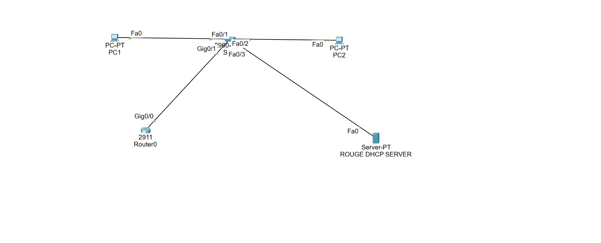
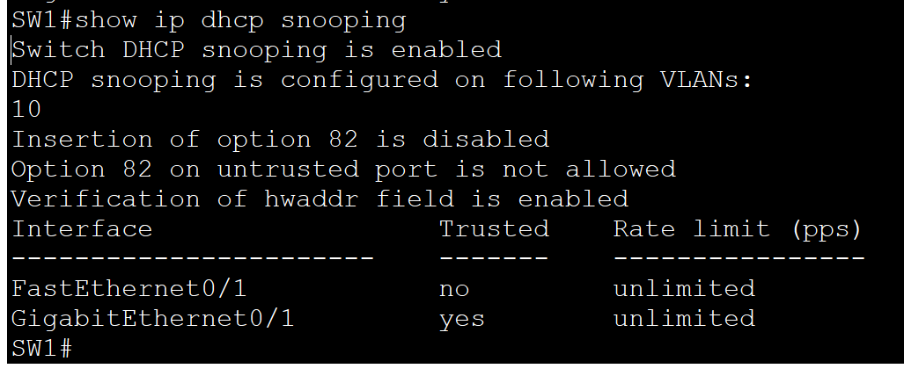
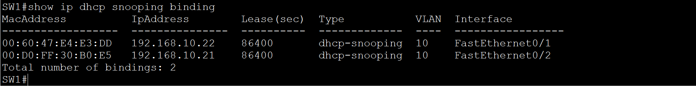
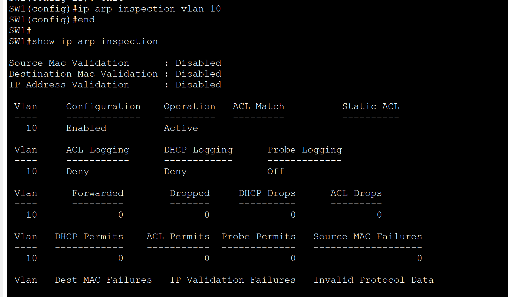
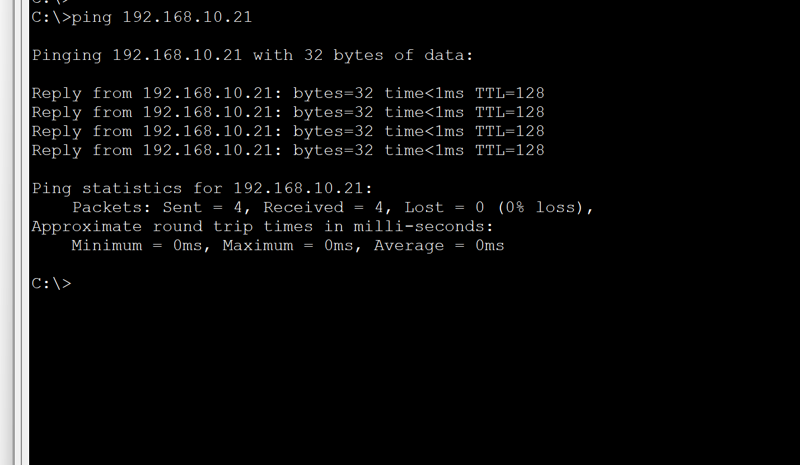

# DHCP Snooping and Dynamic ARP Inspection Lab

Status: DHCP lease learning and connectivity verified; DAI configured and active, enforcement unverified. This lab is not marked fully complete.

## Purpose
Configure DHCP snooping and DAI on VLAN 10, verify learned IP/MAC/port bindings, and investigate a static-IP test that did not demonstrate ARP blocking.

## Observed port and address mapping

| Port | Role / address | MAC | Trust |
|---|---|---|---|
| Fa0/1 | DHCP client 192.168.10.22/24 | 00:60:47:E4:E3:DD | Untrusted for snooping and DAI |
| Fa0/2 | DHCP client 192.168.10.21/24 | 00:D0:FF:30:B0:E5 | Untrusted for snooping and DAI |
| Fa0/3 | Server labeled rogue DHCP server in supplied topology | — | Untrusted |
| Gi0/1 | Uplink to Router0 Gi0/0 in supplied topology | — | Trusted for snooping and DAI |

The tested client reported gateway 192.168.10.1. A topology screenshot is included. Router/server configurations have not been supplied. Topology shows PC1 on Fa0/1, PC2 on Fa0/2, Router0 on Gi0/1, and the server on Fa0/3; rogue DHCP blocking has not been verified.

## Configuration
See `configs/SW1-running-config.txt`. This is transcribed from the provided running configuration, with redundant blank lines and separators removed. VLAN 10 existence is confirmed by `show vlan brief`; that VLAN database entry was not present in the supplied running-config output.

## Verified observations
- DHCP snooping enabled globally and configured for VLAN 10; option 82 insertion disabled.
- Two DHCP bindings restored after testing: .21 on Fa0/2 and .22 on Fa0/1, each with reported lease 86400 seconds.
- VLAN 10 active, containing Fa0/1, Fa0/2, Fa0/3 and Gi0/1.
- DAI enabled and active on VLAN 10; PC ports untrusted and Gi0/1 trusted.
- Client ping to 192.168.10.22 received four replies with no loss before the static-IP test.

## Troubleshooting evidence and limitation
The client normally using .22 was changed to static 192.168.10.99/24. Its binding disappeared, leaving only .21 on Fa0/2. The .99 client successfully pinged .21 after ARP-cache-clearing instructions; DAI statistics reported zero forwarded, permitted and dropped packets in the supplied outputs. This does not prove DAI enforcement. The cause remains unresolved; a Packet Tracer limitation has not been established.

The client was returned to DHCP and received .22; the final table again contained both bindings. A final post-restoration ping was not provided.

## Files
- `packet-tracer/dhcp-snooping-dai.pkt`: original uploaded Packet Tracer file, bytes preserved. Not opened or executed during packaging; its saved state has not been independently verified.
- `configs/SW1-running-config.txt`: supplied switch configuration.
- `evidence/verification.txt`: transcribed verification observations.
- `screenshots/README.md`: evidence captions for the five portfolio screenshots.

## Remaining completion criteria
1. Required configuration and binding screenshots are included; capture additional enforcement evidence before marking the lab complete.
2. Open the Packet Tracer file and confirm the saved configuration matches these observations.
3. Verify connectivity after DHCP restoration.
4. Demonstrate invalid ARP rejection or document a confirmed simulator limitation with evidence. Keep DAI enforcement marked unverified until then.

## Verification commands
```text
show vlan brief
show ip dhcp snooping
show ip dhcp snooping binding
show ip arp inspection
show ip arp inspection interfaces
show ip arp inspection statistics
```

## Add to GitHub
Extract this folder into the repository, adapting its destination to the existing lab structure. Add a lab-index link with status “DHCP verified; DAI enforcement pending.” Do not overwrite an existing lab folder without reviewing the differences.

Suggested commit: `Add DHCP snooping and DAI lab with verification evidence`

## Screenshot gallery






