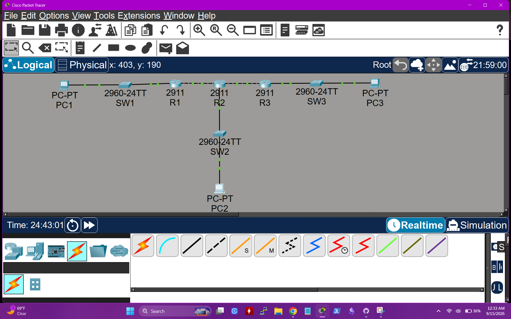
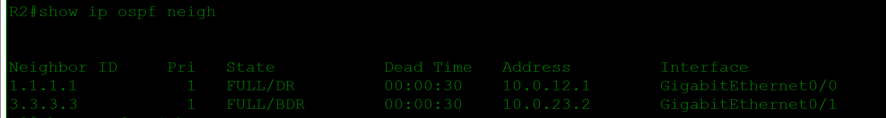
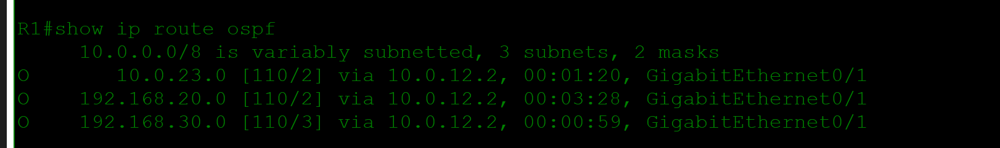
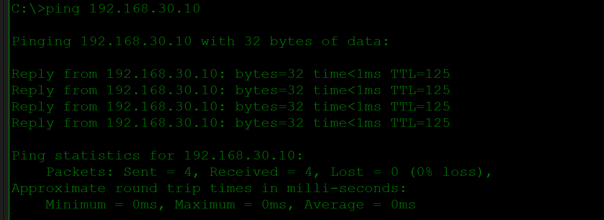
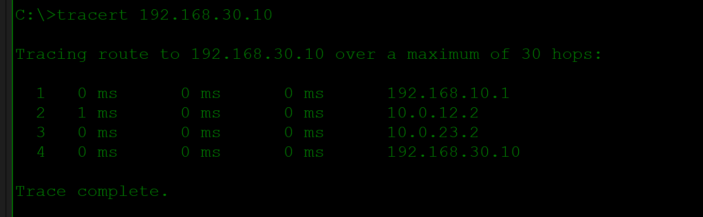
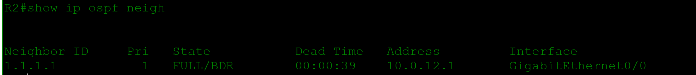
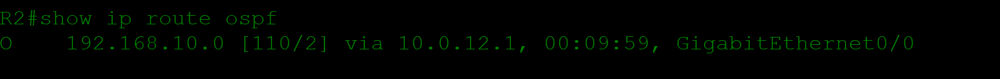
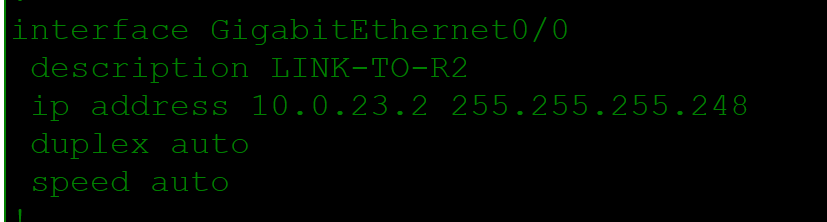

# OSPF Single-Area Routing Lab

> **Status:** In progress — the working Packet Tracer file, topology, OSPF neighbor and route evidence, end-to-end tests, and a subnet-mask fault case are included. Text running-configuration exports are still pending.

## Scenario

A three-site organization needs dynamic routing between its local networks. I configured OSPFv2 area 0 across three Cisco routers, advertised each site's LAN, suppressed unnecessary OSPF hellos toward endpoints, and verified route learning and end-to-end connectivity. I then introduced a realistic subnet-mask mismatch to isolate an adjacency failure.

## Topology



```text
PC1 -- SW1 -- R1 -- R2 -- R3 -- SW3 -- PC3
                     |
                    SW2
                     |
                    PC2
```

## Addressing Plan

| Device | Interface | Address | Purpose |
|---|---|---|---|
| R1 | G0/0 | 192.168.10.1/24 | LAN A gateway |
| R1 | G0/1 | 10.0.12.1/30 | Link to R2 |
| R2 | G0/0 | 10.0.12.2/30 | Link to R1 |
| R2 | G0/1 | 10.0.23.1/30 | Link to R3 |
| R2 | G0/2 | 192.168.20.1/24 | LAN B gateway |
| R3 | G0/0 | 10.0.23.2/30 | Link to R2 |
| R3 | G0/1 | 192.168.30.1/24 | LAN C gateway |
| PC1 | NIC | 192.168.10.10/24 | LAN A endpoint |
| PC2 | NIC | 192.168.20.10/24 | LAN B endpoint |
| PC3 | NIC | 192.168.30.10/24 | LAN C endpoint |

## OSPF Design

| Router | Router ID | Active neighbor-facing interfaces | Passive LAN |
|---|---|---|---|
| R1 | 1.1.1.1 | G0/1 | G0/0 |
| R2 | 2.2.2.2 | G0/0, G0/1 | G0/2 |
| R3 | 3.3.3.3 | G0/0 | G0/1 |

All routing links and LAN prefixes are advertised in area 0. `passive-interface default` prevents OSPF neighbor discovery on user-facing LANs, and only router-to-router interfaces are made active.

## Key Configuration

### R1

```cisco
router ospf 1
 router-id 1.1.1.1
 passive-interface default
 no passive-interface GigabitEthernet0/1
 network 192.168.10.0 0.0.0.255 area 0
 network 10.0.12.0 0.0.0.3 area 0
```

### R2

```cisco
router ospf 1
 router-id 2.2.2.2
 passive-interface default
 no passive-interface GigabitEthernet0/0
 no passive-interface GigabitEthernet0/1
 network 10.0.12.0 0.0.0.3 area 0
 network 10.0.23.0 0.0.0.3 area 0
 network 192.168.20.0 0.0.0.255 area 0
```

### R3

```cisco
router ospf 1
 router-id 3.3.3.3
 passive-interface default
 no passive-interface GigabitEthernet0/0
 network 10.0.23.0 0.0.0.3 area 0
 network 192.168.30.0 0.0.0.255 area 0
```

## Working-State Verification

R2 formed full adjacencies with R1 and R3.



R1 learned the R2-R3 transit network and both remote LANs through OSPF. The `O` code identifies OSPF-learned routes.



PC1 reached PC3 with 0% packet loss.



Traceroute confirmed the expected routed path through R1, R2, and R3.



Useful verification commands:

```cisco
show ip ospf neighbor
show ip route ospf
show ip protocols
show ip ospf interface brief
show ip interface brief
```

## Troubleshooting Case: R3 OSPF Neighbor Missing

### Ticket

LAN C at `192.168.30.0/24` becomes unreachable from the other sites, and R3 no longer appears in R2's OSPF neighbor table.

### Expected State

The R2-R3 link uses `10.0.23.0/30`:

- R2 G0/1: `10.0.23.1/30`
- R3 G0/0: `10.0.23.2/30`
- OSPF area: 0 on both interfaces

### Initial Evidence

R2 showed only R1 (`1.1.1.1`) as a full neighbor. R3 (`3.3.3.3`) was absent.



R2 retained the route learned from R1 but no longer showed the remote LAN C prefix, narrowing the problem to the R2-R3 side of the topology.



### Investigation and Root Cause

The physical link remained operational, so I compared the Layer 3 parameters on both ends instead of treating this as a cable failure. R3 G0/0 had been configured with `255.255.255.248` (`/29`) while R2 G0/1 remained `255.255.255.252` (`/30`).



Root cause: an OSPF hello packet on a broadcast network includes the interface network mask. Because the masks did not match, R2 and R3 rejected the adjacency even though their interfaces could remain `up/up`.

### Corrective Change

```cisco
interface GigabitEthernet0/0
 ip address 10.0.23.2 255.255.255.252
```

### Post-Fix Validation

After restoring R3 to `/30`, R2 again displayed both neighbors in `FULL` state, R1 relearned `192.168.30.0/24`, and PC1 successfully reached PC3.

### Prevention and Faster Future Check

Document point-to-point prefixes and compare both interface masks whenever a link is `up/up` but an OSPF neighbor is missing. Use `show ip ospf neighbor`, `show ip ospf interface`, and `show running-config interface ...` before restarting the routing process.

## Files

- [Open the Packet Tracer lab](packet-tracer/ospf-single-area.pkt)
- [`images/`](images/) contains topology, routing, reachability, and fault evidence.

## Skills Demonstrated

- Single-area OSPFv2 deployment
- Router ID and wildcard-mask configuration
- Passive-interface design
- Neighbor and route-table verification
- End-to-end path validation
- Systematic OSPF adjacency troubleshooting
