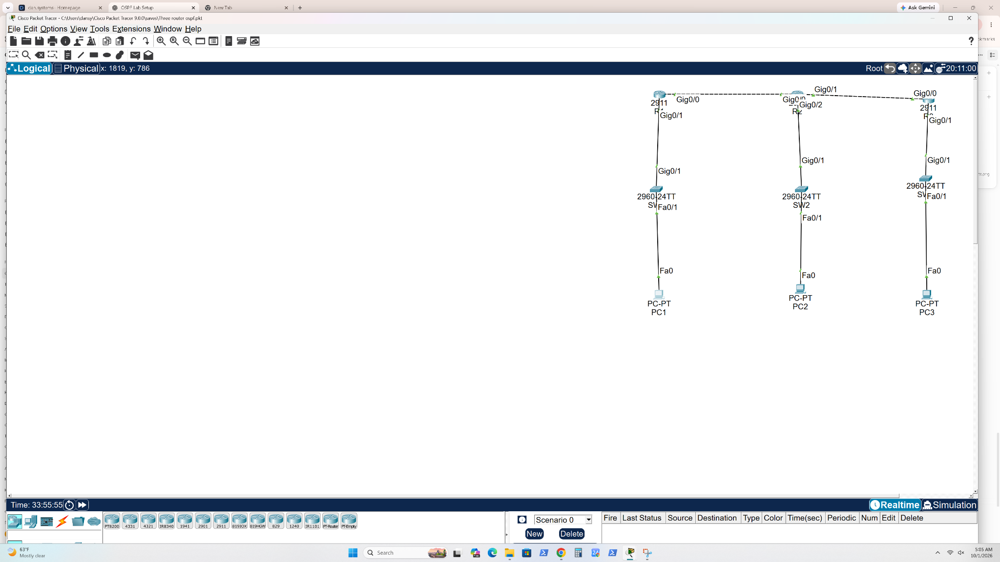
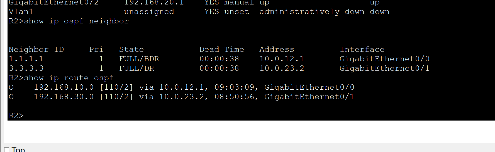
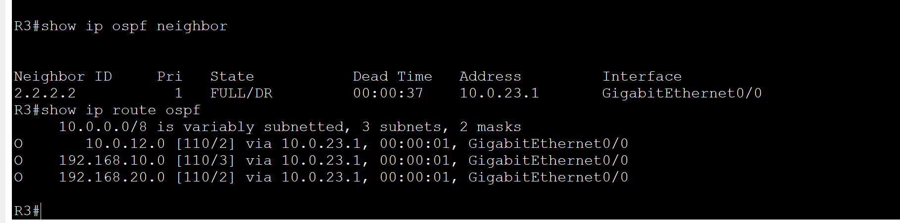
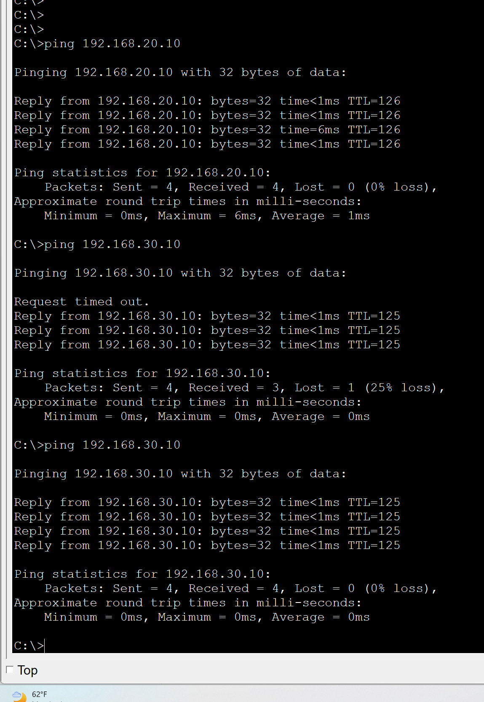

# Three-Router OSPF Lab

Built a three-router network in Cisco Packet Tracer to practice dynamic routing, verify OSPF adjacencies, and test connectivity between remote LANs.

## Topology

R1 connects to R2, and R2 connects to R3. Each router connects to a local switch and PC.



## Addressing

| Device | Interface | Address | Purpose |
| --- | --- | --- | --- |
| R1 | G0/0 | 10.0.12.1 | Link to R2 |
| R1 | G0/1 | 192.168.10.1 | LAN gateway |
| R2 | G0/0 | 10.0.12.2 | Link to R1 |
| R2 | G0/1 | 10.0.23.1 | Link to R3 |
| R2 | G0/2 | 192.168.20.1 | LAN gateway |
| R3 | G0/0 | 10.0.23.2 | Link to R2 |
| R3 | G0/1 | 192.168.30.1 | LAN gateway |

The supplied setup reference specifies /30 transit links and /24 LANs. Router interface screenshots confirm the addresses and active interfaces; they do not display every mask. The setup reference assigns router IDs 1.1.1.1, 2.2.2.2, and 3.3.3.3, which appear in the neighbor evidence.

## Verification evidence

| Check | Observed result | Evidence |
| --- | --- | --- |
| Router interfaces | Used interfaces are up/up on R1, R2, and R3 | Interface screenshots |
| R2 neighbors | 1.1.1.1 and 3.3.3.3 are FULL | r2-neighbors-routes-after.png |
| R2 learned LANs | 192.168.10.0 via 10.0.12.1; 192.168.30.0 via 10.0.23.2 | r2-neighbors-routes-after.png |
| R3 neighbor | 2.2.2.2 is FULL | r3-neighbors-routes.png |
| R3 learned LANs | 192.168.10.0 and 192.168.20.0 via 10.0.23.1 | r3-neighbors-routes.png |
| Remote PC connectivity | Replies from 192.168.20.10 and 192.168.30.10; final tests show 0% loss | remote-pc-pings.png |
| Remote gateway connectivity | Repeated ping to 192.168.30.1 shows 0% loss | pc1-gateway-ping.png |







## Troubleshooting observations

An earlier R2 capture shows only neighbor 1.1.1.1 and the learned 192.168.10.0 route. The later capture shows both expected neighbors and both remote LAN routes. These captures document the change in observed state but do not establish the root cause or exact configuration change.

The ping to 192.168.30.10 initially loses one packet; the repeated test receives all four replies. The screenshot does not establish why the first packet timed out.

R1's interface capture shows `show ip int br` rejected in configuration mode, followed by successful `do show ip int br` output.

The PC1 capture also contains pings to .0 addresses. These are excluded from the host-connectivity results; the meaningful endpoint tests are the .10 PC addresses and .1 gateway address.

## Recheck in Packet Tracer

Open `packet-tracer/ospf_three_router.pkt` and run:

```text
show ip interface brief
show ip ospf neighbor
show ip route ospf
show ip protocols
show running-config
```

Expected neighbors: R1 has R2; R2 has R1 and R3; R3 has R2. Check PC addressing and gateways, then test all PC pairs. The screenshots establish the checks listed above; they do not establish all bidirectional PC-pair tests.

## Scope and remaining evidence

The supplied screenshots were reviewed. The Packet Tracer project is included as supplied, without being opened or simulated during packaging. No exported running configurations were supplied. A direct R1 neighbor/route capture and all PC-pair tests would strengthen the evidence. OSPF area/process settings require inspection in Packet Tracer; the setup reference describes an area 0 lab.
