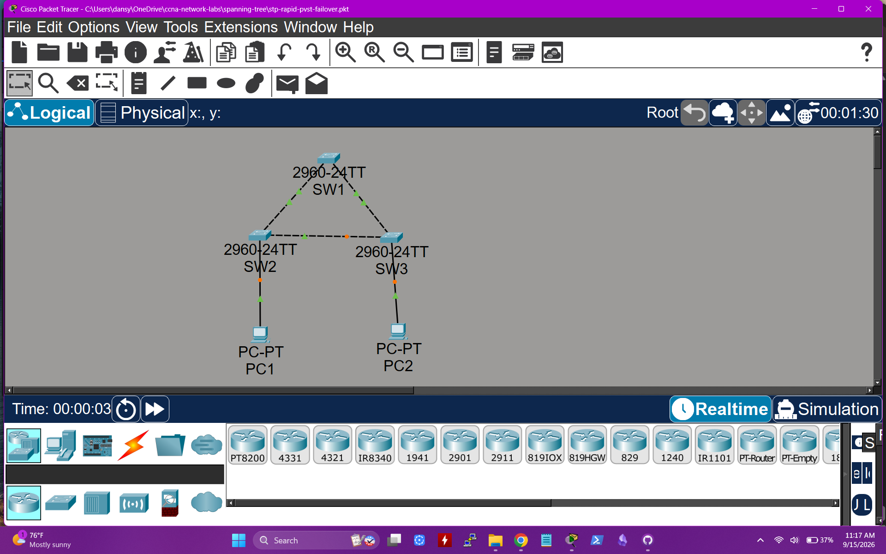
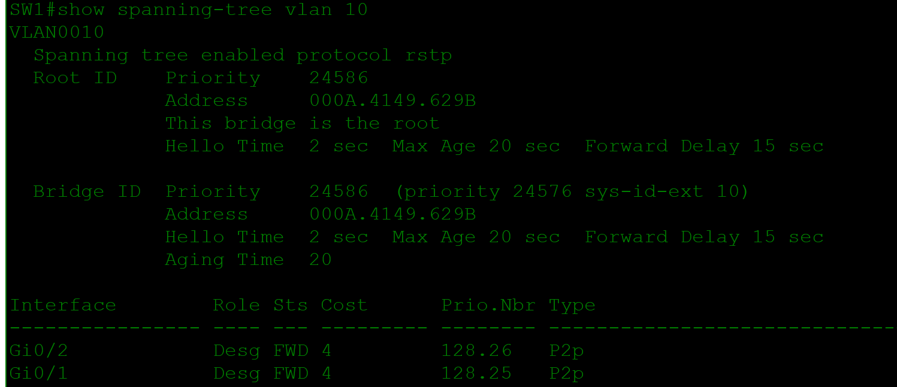
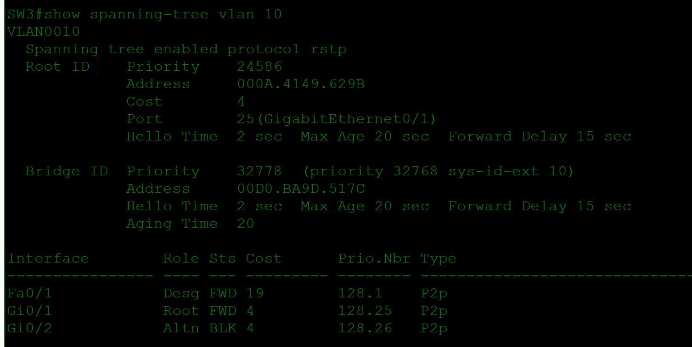
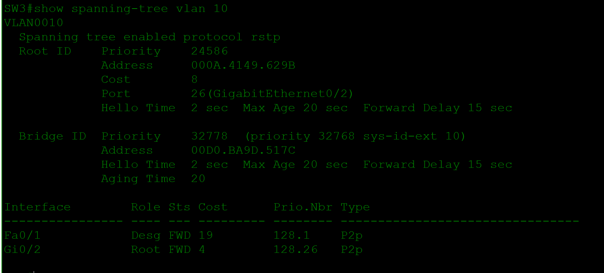
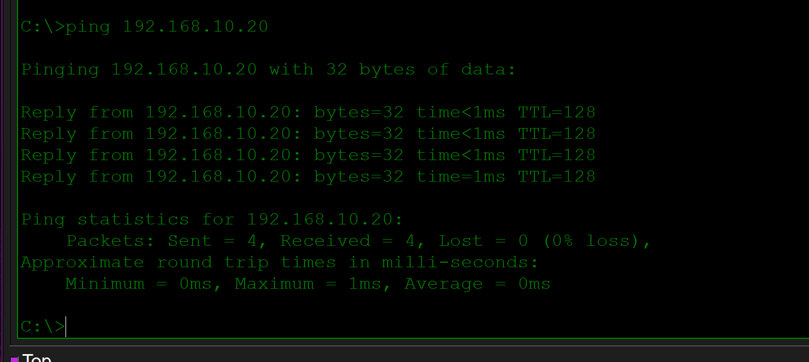
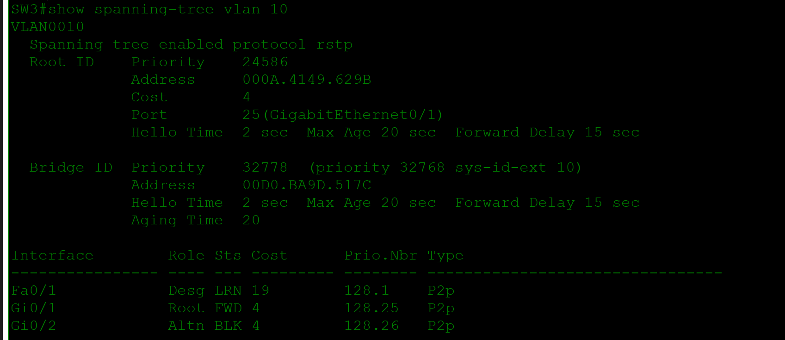

# Rapid PVST+ Spanning Tree and Failover Lab

> **Status:** Complete — includes the Packet Tracer source, topology, root-election evidence, normal port roles, a failed primary uplink, automatic backup-path activation, restored roles, and successful endpoint connectivity.

## Scenario

A small access network needs redundant switch links without creating a Layer 2 loop. I built a three-switch triangle, configured Rapid PVST+ for VLAN 10, selected a deterministic primary and secondary root bridge, and verified that STP blocked the redundant path. I then disabled SW3's active root port and confirmed that Rapid STP moved the backup port into forwarding state.

## Topology



```text
          SW1
         /   \
       SW2---SW3
        |     |
       PC1   PC2
```

| Connection | Interfaces | Role |
|---|---|---|
| SW1 to SW2 | Gi0/1 to Gi0/1 | Primary redundant link |
| SW1 to SW3 | Gi0/2 to Gi0/1 | SW3's normal path to root |
| SW2 to SW3 | Gi0/2 to Gi0/2 | Backup path for SW3 |
| PC1 to SW2 | Fa0 to Fa0/1 | VLAN 10 access link |
| PC2 to SW3 | Fa0 to Fa0/1 | VLAN 10 access link |

## Addressing and VLAN Plan

| Endpoint | Address | Mask | VLAN |
|---|---|---|---:|
| PC1 | 192.168.10.10 | 255.255.255.0 | 10 |
| PC2 | 192.168.10.20 | 255.255.255.0 | 10 |

No default gateway is required because both endpoints are in the same IP subnet.

## STP Design

| Switch | VLAN 10 priority | Intended role |
|---|---:|---|
| SW1 | 24576 | Primary root bridge |
| SW2 | 28672 | Secondary root bridge |
| SW3 | 32768 | Access switch |

With SW1 as root, its active ports are designated and forwarding. SW3 normally uses Gi0/1 as its root port and holds Gi0/2 as the alternate blocked path.

## Key Configuration

### All switches

```cisco
spanning-tree mode rapid-pvst

vlan 10
 name USERS

interface range GigabitEthernet0/1-2
 switchport mode trunk
 switchport trunk allowed vlan 10
```

### SW1

```cisco
spanning-tree vlan 10 priority 24576
```

### SW2

```cisco
spanning-tree vlan 10 priority 28672

interface FastEthernet0/1
 switchport mode access
 switchport access vlan 10
 spanning-tree portfast
 spanning-tree bpduguard enable
```

### SW3

```cisco
spanning-tree vlan 10 priority 32768

interface FastEthernet0/1
 switchport mode access
 switchport access vlan 10
 spanning-tree portfast
 spanning-tree bpduguard enable
```

## Normal-State Verification

SW1 identifies itself as the VLAN 10 root bridge. Both of its trunk ports are designated and forwarding, which is expected on a root bridge.



SW3 normally selects Gi0/1 as `Root FWD` and holds Gi0/2 as `Altn BLK`. This prevents frames from circulating around the switch triangle.



Useful verification commands:

```cisco
show spanning-tree vlan 10
show interfaces trunk
show vlan brief
```

## Failover Test: SW3 Primary Root Path Fails

### Expected State

- SW3 Gi0/1 is the normal root port with path cost 4.
- SW3 Gi0/2 is the alternate blocked port.
- PC1 and PC2 communicate across VLAN 10.

### Injected Failure

I administratively disabled SW3 Gi0/1, simulating failure of its direct uplink to the root bridge.

```cisco
interface GigabitEthernet0/1
 shutdown
```

### STP Response

Rapid PVST+ moved Gi0/2 from the alternate blocked role to `Root FWD`. The reported root-path cost increased from 4 to 8 because the backup path reaches SW1 through SW2 instead of using the direct SW3-to-SW1 link.



### Connectivity Validation

PC1 successfully reached PC2 with 0% packet loss, showing that VLAN 10 remained operational over the backup path.



### Restoration

I restored SW3 Gi0/1:

```cisco
interface GigabitEthernet0/1
 no shutdown
```

After reconvergence, Gi0/1 returned as `Root FWD` with cost 4 and Gi0/2 returned to `Altn BLK`.



## Operational Takeaways

- Redundant physical links require STP to prevent Layer 2 loops.
- The root bridge should be selected intentionally instead of left to MAC-address election.
- An alternate blocked port is healthy standby capacity, not necessarily a fault.
- Rapid PVST+ can activate a backup path when the active root path fails.
- STP roles and root-path cost show which path the switch is actually using.
- PortFast and BPDU Guard protect endpoint-facing access ports and should not be placed on switch-to-switch trunks.

## Files

- [Open the Packet Tracer lab](packet-tracer/stp-rapid-pvst-failover.pkt)
- [`images/`](images/) contains the topology, STP state, failover, recovery, and connectivity evidence.

## Skills Demonstrated

- Rapid PVST+ configuration
- Root and secondary bridge selection
- Root, designated, and alternate port analysis
- Layer 2 loop prevention
- Uplink failover and reconvergence verification
- PortFast and BPDU Guard configuration
