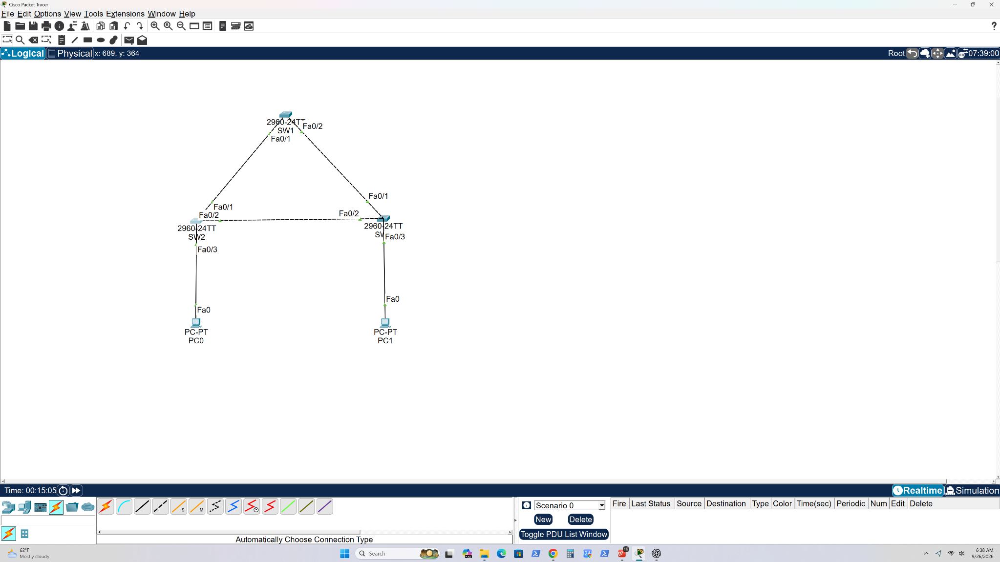

# Spanning Tree Protocol: VLAN 10 link failover

## Goal

Verify that STP blocks a redundant switch link in a three-switch triangle and selects that backup path when the active root path fails.

## Topology



Three Cisco 2960 switches form a triangle. PC0 connects to the lower-left switch; PC1 connects to the lower-right switch. Both hosts are in VLAN 10 (`192.168.10.0/24`). The Packet Tracer project is [`stp-failover-lab.pkt`](stp-failover-lab.pkt).

**Naming note:** Packet Tracer's canvas labels and CLI hostnames differ in these captures. The top switch labeled **SW1** appears as `Switch0#` in its CLI; the lower-left switch labeled **SW2** appears as `Switch1#`. The bridge MAC addresses and ports connect the before and after outputs.

## Verification and failure test

| Stage | Observation | Evidence |
| --- | --- | --- |
| Root election | Top switch is VLAN 10 root, bridge MAC `00E0.F931.53D9`, configured priority 24576 (displayed VLAN 10 bridge priority 24586). Its Fa0/1 and Fa0/2 are designated forwarding. | [Root bridge](screenshots/stp-sw1-root-bridge.png) |
| Normal redundant topology | On the lower-left switch, Fa0/1 is `Root FWD` at cost 19; Fa0/2 is `Altn BLK`. | [Before failure](screenshots/stp-sw2-before-root-and-blocked.png) |
| Failed root path | After the active path is shut, the lower-left switch selects Fa0/2 as `Root FWD`, with total root path cost 38 through another switch. | [After failover](screenshots/stp-sw2-after-backup-forwarding.png) |
| Host connectivity | PC0 receives four replies from `192.168.10.12` with 0% loss in the captured ping after failover. | [Ping after failover](screenshots/stp-ping-after-failover.png) |

The STP output reports `protocol ieee`, so this evidence describes classic 802.1D STP behavior. The screenshots show reachability after convergence; they do not measure convergence time or prove that no packets were lost during the transition.

## Repeat the test

1. Open the `.pkt` file and verify all three switch links are up.
2. On the lower-left switch, run `show spanning-tree vlan 10`. Identify its current `Root FWD` and `Altn BLK` ports before changing anything.
3. Shut the current root port on that switch. In the captured run it was Fa0/1:

   ```text
   enable
   configure terminal
   interface fastethernet0/1
   shutdown
   end
   ```

4. Wait for STP to converge. Run `show spanning-tree vlan 10` again; the previously blocked Fa0/2 should become `Root FWD`.
5. From PC0, run `ping 192.168.10.12`.
6. Restore the link, then recheck the port roles:

   ```text
   configure terminal
   interface fastethernet0/1
   no shutdown
   end
   show spanning-tree vlan 10
   ```

If the saved project opens with Fa0/1 down, perform step 6 first and wait for normal roles before repeating the test.
