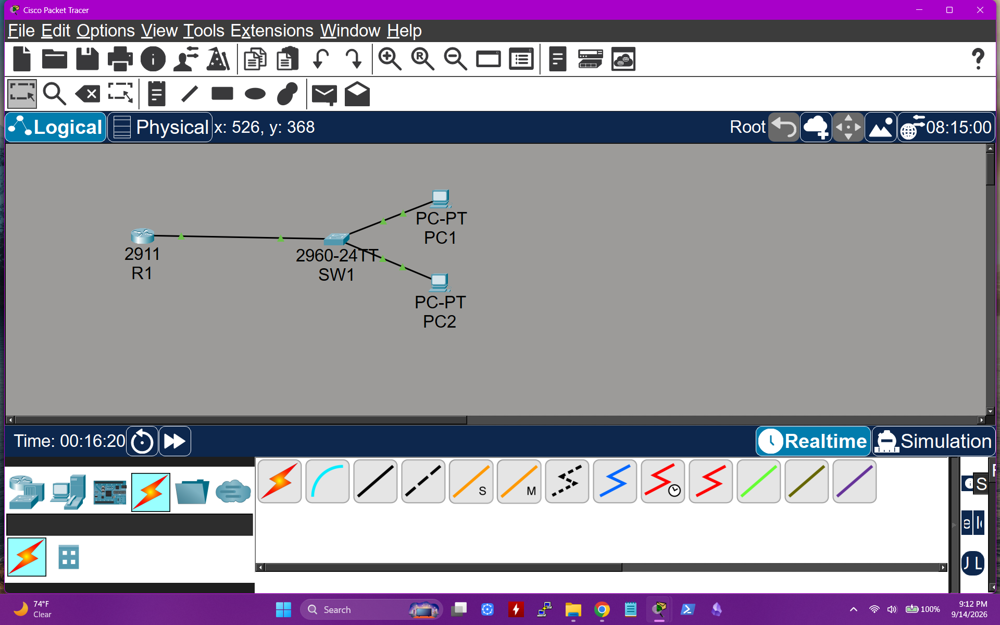
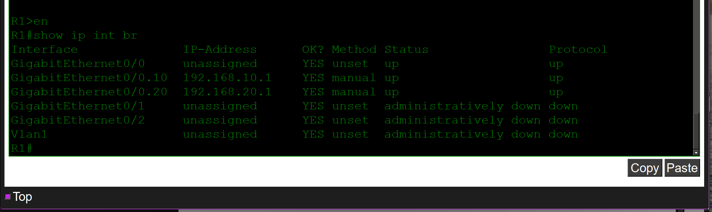
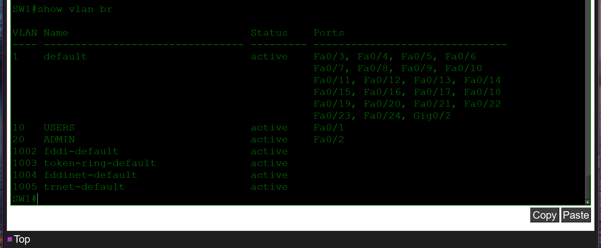
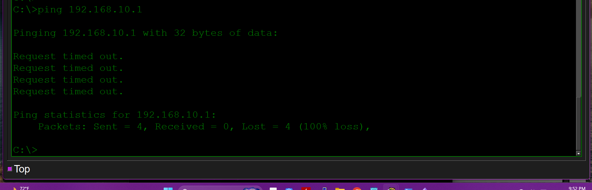
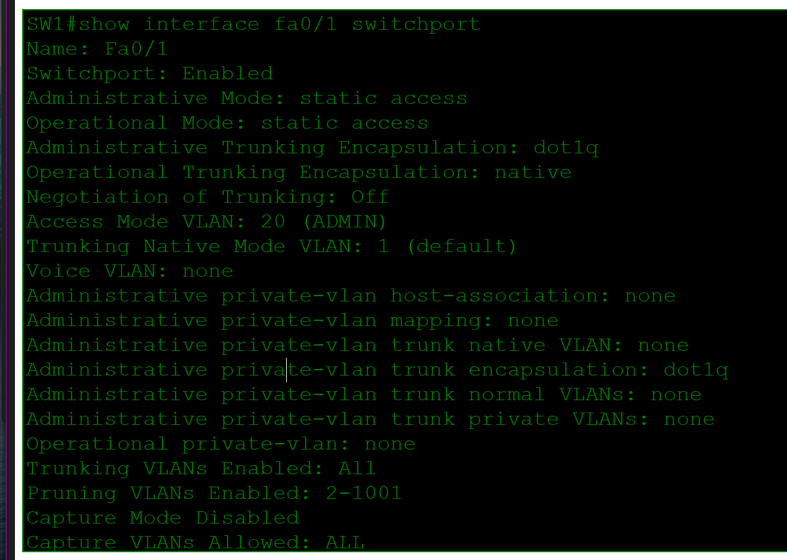
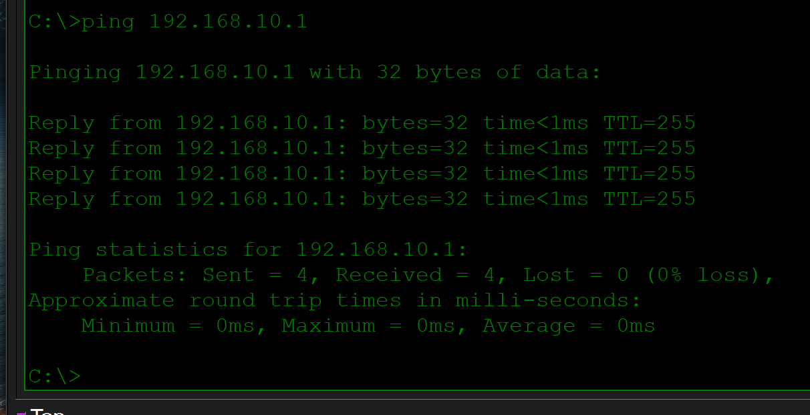

# VLAN and Inter-VLAN Routing Lab

> **Status:** In progress — the working Packet Tracer file, topology, device-state evidence, and one fault/recovery case are included. Text configuration exports, trunk output, and a captured PC1-to-PC2 test are still needed for a complete evidence set.

## Scenario

A small office needs its user and administrative endpoints separated into different broadcast domains while retaining Layer 3 connectivity. I built VLAN 10 for users and VLAN 20 for administrators, configured an 802.1Q uplink, and used router-on-a-stick to provide a default gateway for each subnet.

## Topology



| Link | Switch port | Role |
|---|---|---|
| PC1 to SW1 | Fa0/1 | VLAN 10 access port |
| PC2 to SW1 | Fa0/2 | VLAN 20 access port |
| SW1 to R1 | Gi0/1 | 802.1Q trunk carrying VLANs 10 and 20 |

## Addressing and VLAN Plan

| Device | Interface | Address | VLAN | Purpose |
|---|---|---|---:|---|
| R1 | G0/0.10 | 192.168.10.1/24 | 10 | USERS default gateway |
| R1 | G0/0.20 | 192.168.20.1/24 | 20 | ADMIN default gateway |
| PC1 | FastEthernet0 | 192.168.10.10/24 | 10 | User endpoint |
| PC2 | FastEthernet0 | 192.168.20.10/24 | 20 | Administrative endpoint |

## Requirements

- Place PC1 in VLAN 10 and PC2 in VLAN 20.
- Carry both VLANs between SW1 and R1 over an 802.1Q trunk.
- Use R1 subinterfaces as the two default gateways.
- Verify endpoint-to-gateway and inter-VLAN connectivity.
- Diagnose and repair a deliberately incorrect access-VLAN assignment.

## Key Configuration

### SW1

```cisco
vlan 10
 name USERS
vlan 20
 name ADMIN

interface FastEthernet0/1
 description PC1-USERS
 switchport mode access
 switchport access vlan 10
 spanning-tree portfast

interface FastEthernet0/2
 description PC2-ADMIN
 switchport mode access
 switchport access vlan 20
 spanning-tree portfast

interface GigabitEthernet0/1
 description TRUNK-TO-R1
 switchport mode trunk
 switchport trunk allowed vlan 10,20
```

### R1

```cisco
interface GigabitEthernet0/0
 description TRUNK-TO-SW1
 no shutdown

interface GigabitEthernet0/0.10
 description VLAN10-USERS-GATEWAY
 encapsulation dot1Q 10
 ip address 192.168.10.1 255.255.255.0

interface GigabitEthernet0/0.20
 description VLAN20-ADMIN-GATEWAY
 encapsulation dot1Q 20
 ip address 192.168.20.1 255.255.255.0
```

## Verification

The router evidence shows both subinterfaces in the `up/up` state with the expected gateway addresses.



The repaired switch state places Fa0/1 in VLAN 10 and Fa0/2 in VLAN 20.



Useful verification commands:

```cisco
show vlan brief
show interfaces trunk
show interfaces FastEthernet0/1 switchport
show ip interface brief
```

## Troubleshooting Case: PC1 Cannot Reach Its Gateway

### Ticket

PC1 in the USERS network cannot reach its default gateway at `192.168.10.1`.

### Expected State

PC1 uses address `192.168.10.10/24`, gateway `192.168.10.1`, and switch port Fa0/1 in VLAN 10.

### Initial Evidence

The original test returned four timeouts, confirming 100% packet loss to the local gateway.



### Investigation and Root Cause

Because the unreachable address was PC1's directly connected default gateway, I checked the endpoint's access-layer assignment before changing the router. The command below showed that Fa0/1 was operating as a static access port in VLAN 20 instead of VLAN 10.

```cisco
show interfaces FastEthernet0/1 switchport
```



Root cause: the switch access port and PC subnet did not match. PC1 sent untagged frames into VLAN 20, so they could not reach R1's VLAN 10 subinterface.

### Corrective Change

```cisco
interface FastEthernet0/1
 switchport access vlan 10
```

### Post-Fix Validation

After restoring Fa0/1 to VLAN 10, PC1 received four replies from `192.168.10.1` with 0% packet loss.



### Prevention and Faster Future Check

Use interface descriptions, document the VLAN-to-port plan, and compare the endpoint subnet with `show vlan brief` and `show interfaces switchport` before investigating routing. This isolates an access-layer mismatch quickly and avoids unnecessary router changes.

## Files

- [Open the Packet Tracer lab](packet-tracer/vlan-intervlan-routing.pkt)
- [`images/`](images/) contains the topology and troubleshooting evidence.

## Skills Demonstrated

- VLAN creation and access-port assignment
- 802.1Q trunk configuration
- Router-on-a-stick and default gateways
- Layer 2 versus Layer 3 fault isolation
- Evidence-based corrective changes and validation
